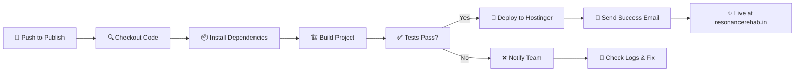

# 🚀 INCIAL Team - Resonance Rehab Deployment Guide

Welcome to the Resonance Rehab deployment automation! This guide explains how the CI/CD pipeline works and how to use it as an INCIAL team member.

---

## 📋 Quick Overview

**What:** Automatic deployment of Resonance Rehab to production whenever code is pushed  
**When:** Every push to the `publish` branch triggers auto-deployment  
**Where:** Live at https://resonancerehab.in  
**Who:** All INCIAL team members  

---

## 🎯 Deployment Workflow

```
┌─────────────────────────────────────────────────────────────────────────┐
│                    INCIAL TEAM MEMBER WORKFLOW                          │
├─────────────────────────────────────────────────────────────────────────┤
│                                                                         │
│  1. Clone Repository                                                    │
│     git clone https://github.com/incial/resonance_rehab.git            │
│                                                                         │
│  2. Create Feature Branch                                               │
│     git checkout -b feature/your-feature                               │
│     git checkout -b fix/your-fix                                       │
│                                                                         │
│  3. Make Changes & Commit                                               │
│     git add .                                                           │
│     git commit -m "Description of changes"                             │
│                                                                         │
│  4. Push to Main (or staging)                                           │
│     git push origin feature/your-feature                               │
│     (Create Pull Request for team review)                              │
│                                                                         │
│  5. After Approval → Merge & Push to Publish                           │
│     git checkout publish                                               │
│     git merge feature/your-feature                                     │
│     git push origin publish  ← TRIGGERS AUTO-DEPLOYMENT                │
│                                                                         │
│  6. Deployment Happens Automatically                                    │
│     ✅ Code builds                                                      │
│     ✅ Tests run                                                        │
│     ✅ Deployed to Hostinger                                           │
│     ✅ Live at https://resonancerehab.in                               │
│     ✅ Email notification sent to team                                 │
│                                                                         │
└─────────────────────────────────────────────────────────────────────────┘
```

---

## 🔄 Branches Explained

### `main` - Development Branch
- **Purpose:** Main development branch
- **Who commits:** All team members
- **Deployment:** No
- **When to use:** Daily development, feature branches merge here

### `publish` - Production Branch  
- **Purpose:** Stable, production-ready code
- **Who commits:** Only merged from main (via PR)
- **Deployment:** **YES - AUTO-DEPLOYS TO HOSTINGER** 🚀
- **When to use:** Only merge tested, approved features here

### Feature/Fix Branches
- **Pattern:** `feature/feature-name`, `fix/bug-name`
- **Deployment:** No
- **When to use:** Create before starting any work

---

## 📝 Step-by-Step: Making Changes

### 1️⃣ Clone the Repository (First Time Only)

```bash
git clone https://github.com/incial/resonance_rehab.git
cd resonance_rehab
git checkout main
```

### 2️⃣ Create Your Feature Branch

```bash
# Always create a new branch for your work
git checkout -b feature/add-new-feature
# or
git checkout -b fix/fix-homepage-bug
```

**Branch naming conventions:**
- `feature/description` - New features
- `fix/description` - Bug fixes
- `refactor/description` - Code refactoring
- `docs/description` - Documentation updates

### 3️⃣ Make Your Changes

```bash
# Edit files as needed
nano src/components/MyComponent.jsx

# Test locally
pnpm install
pnpm run dev

# Commit changes
git add src/components/MyComponent.jsx
git commit -m "Add new feature: description"

# Commit often with meaningful messages
```

### 4️⃣ Push Your Changes to GitHub

```bash
git push origin feature/add-new-feature
```

### 5️⃣ Create a Pull Request (PR)

1. Go to https://github.com/incial/resonance_rehab
2. Click "Compare & pull request"
3. Add title and description
4. Request review from team members
5. Wait for approval

### 6️⃣ After Approval - Merge to Publish

Once your PR is reviewed and approved:

```bash
# Get latest publish branch
git checkout publish
git pull origin publish

# Merge your feature
git merge feature/add-new-feature

# Push to publish (TRIGGERS DEPLOYMENT!)
git push origin publish
```

⚠️ **After push to publish, check deployment status:**
- GitHub Actions tab: https://github.com/incial/resonance_rehab/actions
- Email notification from GitHub Actions
- Live site: https://resonancerehab.in

---

## 🚨 Deployment Failures

### What to do if deployment fails?

1. **Check the logs:**
   - Go to GitHub Actions tab
   - Click the failed workflow
   - Scroll to see which step failed

2. **Common issues:**

| Error | Solution |
|-------|----------|
| Build failed | Check console errors, run `pnpm install` and `pnpm run build` locally |
| Dependencies missing | Run `pnpm install` to ensure all packages are installed |
| File permissions | Check if .htaccess file is readable |
| Git deployment failed | Check SSH key configuration (admin only) |

3. **If stuck:**
   - Post in team Slack
   - Check `DEPLOYMENT_SETUP.md` for detailed troubleshooting
   - Contact DevOps team (admin)

---

## ✅ Deployment Verification

After pushing to `publish` branch:

1. **Check GitHub Actions**
   ```
   GitHub → incial/resonance_rehab → Actions tab
   ```

2. **Wait for workflow to complete** (~2-3 minutes)

3. **Receive email notification** from GitHub Actions

4. **Verify live site:**
   ```
   https://resonancerehab.in
   ```

5. **Test key functionality:**
   - Homepage loads ✓
   - Navigation works ✓
   - Forms submit ✓
   - Images load ✓

---

## 🛠️ Local Setup (For New Team Members)

### Prerequisites
- Git installed
- Node.js 18+ installed
- pnpm installed (`npm install -g pnpm`)

### First Time Setup

```bash
# 1. Clone the repo
git clone https://github.com/incial/resonance_rehab.git
cd resonance_rehab

# 2. Install dependencies
pnpm install

# 3. Start development server
pnpm run dev

# 4. Open browser
# Navigate to http://localhost:5173 (or the port shown in terminal)
```

### Available Commands

```bash
pnpm run dev      # Start dev server (http://localhost:5173)
pnpm run build    # Build for production
pnpm run preview  # Preview production build locally
pnpm run lint     # Check code quality
pnpm run format   # Format code
```

---

## 📊 Deployment Pipeline Stages



---

## 🔐 Security Notes

- **Never** push credentials or secrets
- **Always** create feature branches for your work
- **Wait** for code review before merging to publish
- **Test** locally before pushing (`pnpm run dev`)
- **Check** GitHub Actions before assuming deployment worked

---

## 📞 Support & Questions

| Question | Where to Ask |
|----------|-------------|
| Code review? | Create PR and request reviewers |
| Deployment issue? | Check Actions tab and logs |
| Feature request? | Create GitHub issue |
| General help? | Ask in team Slack #dev channel |
| Urgent deployment needed? | Contact DevOps (admin) |

---

## 🎓 Key Takeaways

✨ **Remember:**
1. Always work on feature branches
2. Create PRs for code review
3. Only merge to `publish` after approval
4. `publish` branch auto-deploys to production
5. Check Actions tab to verify deployment
6. Team gets email notification on every deployment

---

## 📚 Additional Resources

- **Setup Instructions:** [DEPLOYMENT_SETUP.md](DEPLOYMENT_SETUP.md)
- **Troubleshooting:** [DEPLOYMENT_CHECKLIST.md](DEPLOYMENT_CHECKLIST.md)
- **Main Deployment README:** [README_DEPLOYMENT.md](README_DEPLOYMENT.md)
- **Live Site:** https://resonancerehab.in
- **GitHub Repository:** https://github.com/incial/resonance_rehab

---

**Happy coding! 🎉**

*Last updated: March 2026*
